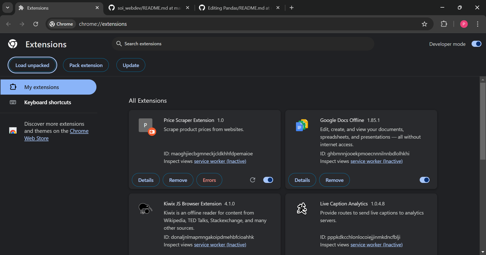

# Financial Saving Extension

A web extension that helps users compare product prices across multiple websites, allowing them to filter and find the most cost-effective options.

## How to Run the Code

### Prerequisites
- Node.js and npm

### Setup

#### 1. Clone the Repository
Run the following command in your terminal:
bash
git clone https://github.com/nay-hey/soi_webdev.git

Alternatively, you can download the repository as a .zip file and extract it.

#### 2. Setting Up the Backend

Navigate to the backend directory:
bash
cd Pandas-main/backend

Install dependencies:
bash
npm install

Start the development server:
bash
node index.js

#### 3. Adding the Extension to Google Chrome

1. Open Google Chrome and go to:
   
   chrome://extensions/
   
2. Enable *Developer Mode* by toggling the switch in the top right corner.
3. Click *Load Unpacked* (top left corner).
4. Select the "Pandas-main/extension" folder and upload it.

#### 4. Testing the Extension

1. Open a new Google Chrome tab and search for any item.
2. Click on the *Extensions* icon in the toolbar.
3. Select the *Price Scraper Extension*.
4. View and filter search results from multiple websites.

---

Enjoy saving money with the Financial Saving Extension! 🚀
